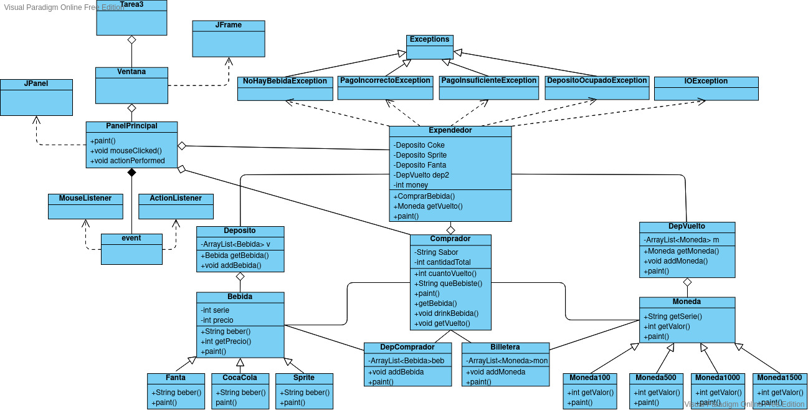
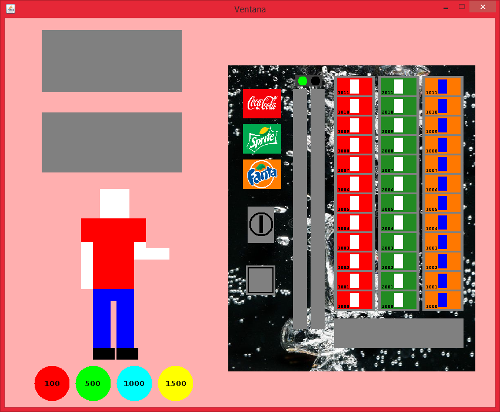

# homework_3  

## Integrantes  

- Daniela Alejandra Novoa Opazo
- Jorge Ignacio Santis Martinez  
 
  Bienvenidos a nuestra tarea donde encontrará 3 branches: main, expendedor y comprador.   
  En la branch comprador encontrará los avances inciales de la tarea además de la primera creación del comprador, en expendedor es donde finalmente terminamos haciendo la mayoría del trabajo y los avances finales.  
  
  En main está el trabajo finalizado separado en 13 clases, se han hecho ediciones y cambios a la versión de la expendedora creada en la Tarea 2 a favor de adecuarnos a las exigencias de la tarea 3.  
  
  Esta tarea fue realizada asignando partes  de trabajo equitativas a ambos integrantes.  
    
  Diagrama UML:
  
    
    
  Captura de Pantalla de la interfaz en el origen del proyecto:  
  
    
